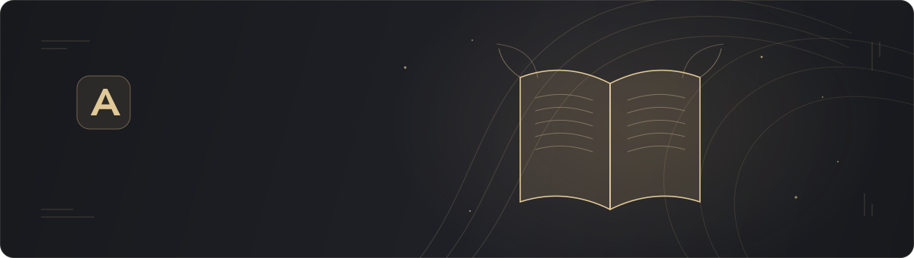

<div align="center">



# Make room for the story.

**A writing studio for the whole book—from the first loose idea to the final export.**

Write in a calm, focused workspace. Keep your manuscript, world, plot, revisions, and publishing plans together—and keep your files yours.

<br>

[](#windows-desktop)
[](#windows-desktop)
[](#your-work-stays-yours)


<br>

[Get started](#get-started) · [Explore the studio](#inside-the-studio) · [Keep projects in Git](#your-work-stays-yours) · [Build for Windows](#windows-desktop)

</div>

<br>

> [!NOTE]
> Veritas Studio is a local-first writing app. The Windows desktop app is powered by Electron; the same writing interface can also run in a modern browser.

## Your story, in one considered workspace

Long-form writing rarely happens in one place. Drafts end up in one folder, character notes in another, and the shape of the story somewhere in between. Veritas brings those parts into a single studio without locking your manuscript into a proprietary format.

| **Write** | **Build** | **Finish** |
|:---|:---|:---|
| A rich manuscript editor with Markdown at its core, autosave, word counts, reading time, and daily goals. | A project binder for chapters and worldbuilding, plus a visual planner for threads, events, and arcs. | Revision snapshots, checklists, book metadata, launch planning, and exports for the formats you need. |

## Inside the studio

<table>
<tr>
<td width="50%" valign="top">

### ✍️ A writing space that stays out of the way

- Rich editing for headings, emphasis, quotations, and lists
- Manuscript files remain portable Markdown
- Chapter-specific notes in the Inspector, saved with each project
- Daily word goals, project manuscript targets with completion estimates, live word count, and reading-time estimates
- Find and replace, undo and redo, and split-editor views
- Themes, editor sizing, and a focused, adjustable workspace

</td>
<td width="50%" valign="top">

### 🗺️ A world with room to grow

- A binder for chapters, characters, locations, factions, timelines, and a custom-word dictionary
- Structured worldbuilding fields with editable templates
- **The Sorth** surfaces worldbuilding notes mentioned in your draft
- A plot planner for story threads, events, arcs, and Surface/Shadow layers
- Vault-wide search to find the detail you know you wrote

</td>
</tr>
<tr>
<td width="50%" valign="top">

### 🪶 From first thought to final draft

Turn on only the parts of the process you need:

**Ideation** for loglines and premises · **Writing** for manuscripts and story planning · **Editing** for snapshots and revision checklists · **Publishing** for book details, marketing, launch planning, and finances.

</td>
<td width="50%" valign="top">

### 📚 Take the work with you

- Export a document, a chapter, or the full manuscript
- Choose Markdown, DOCX, or print-to-PDF
- Configure title pages and chapter page breaks
- Export and import a complete project archive
- Keep a simple project-scoped to-do list close at hand

</td>
</tr>
</table>

## Get started

### Run in a browser

Open `index.html` in a modern browser. For direct access to a project folder, serve the app from `localhost` (for example, with VS Code Live Server); browser folder access requires a supported browser and a secure context. Choose **Open vault** to work in a folder.

If folder access is unavailable, Veritas uses a browser-local vault. Browser-local projects are stored in that browser on that device; they are not automatically included in a Git checkout.

The first-run **Veritas Studio Tutorial** workspace includes editable walkthroughs for chapters, chapter notes, worldbuilding entries and templates, timelines, the plot planner, and the Ideation, Editing, and Publishing modules. The lifecycle modules are optional; enable them from the project switcher to explore their guides.

### Run the Windows desktop app

**Requirements:** Windows, Node.js 24, and npm.

```powershell
git clone https://github.com/LeonardoCarolo99/Veritas.Studio.git
cd Veritas.Studio
npm ci
npm start
```

To build a Windows installer:

```powershell
npm run dist:win
```

The installer is written to `dist/`. The packaged app checks GitHub Releases for updates at startup and periodically while running. You can also check from **Settings → Updates**. Running from source does not perform update checks.

## Your work stays yours

Veritas stores manuscript content as Markdown and project details as JSON. Choose the project home that suits you:

- **Browser vault:** stored locally in your browser.
- **Folder-backed project:** files are read and written directly in a folder you choose.
- **Project archive:** export a `.veritas.json` archive, then import it on another device.

### Keep a project in Git

1. Open the project switcher and choose **Copy current project into repository root**.
2. Select the root of your Veritas Studio checkout. The app creates a new `<project-name>/` folder and leaves the browser project intact.
3. Commit and push that project folder:

   ```powershell
   git add "<project-name>"
   git commit -m "Add writing project"
   git push
   ```

4. On another PC, pull or clone the repository, start Veritas, choose **Open existing folder**, and select the project folder.
5. After editing, commit and push the updated project files. Pull those changes on the other PC before continuing there.

> [!IMPORTANT]
> Git syncs the project files—not browser permissions—and does not resolve simultaneous edits. Sync before switching devices, and avoid editing the same project on two PCs at once.

## A project shaped around your process

Enable the lifecycle modules that are useful to you from the project manager. You can change them later without moving your project files.

| Module | What it holds |
|:---|:---|
| **Ideation** | Logline, premise, and conceptual notes |
| **Writing** | Manuscript, worldbuilding binder, and plot planner |
| **Editing** | Named manuscript snapshots and revision checklists |
| **Publishing** | Book metadata, marketing copy, launch checklist, income, and expenses |
| **To-do** | Small next steps for the current project |

Each project keeps its own files, enabled modules, and writing statistics. A new project starts with Writing enabled.

### Project files at a glance

```text
My Novel/
├── Manuscript/       Chapters and notes (.md)
├── Worldbuilding/    Characters, locations, and factions
├── Timelines/        Timeline notes and plot planner data
├── Todos/            Project tasks
├── Ideation/         Premise and concept notes
├── Editing/          Revision data and checklists
├── Publishing/       Book, launch, and portfolio data
└── config.json       Project settings and writing goals
```

## Windows desktop

The Electron app wraps the shared writing interface in a frameless Windows window with custom controls and an application menu. Its preload bridge provides the renderer with project-folder selection and Markdown/JSON file operations; Node.js integration is disabled in the renderer.

### Publish a release

The GitHub Actions workflow at `.github/workflows/release-windows.yml` builds and publishes a Windows installer when a version tag is pushed.

1. Update the version in `package.json` and commit the change.
2. Create and push a matching version tag. For package version `1.0.7`, the tag would be `v1.0.7`.

   ```powershell
   git tag v1.0.7
   git push origin main
   git push origin v1.0.7
   ```

The first release must be published before installed copies can receive updates. Branch pushes alone do not update installed apps. A Windows code-signing certificate is recommended to provide a smoother installation experience.

## Built with

**HTML · CSS · JavaScript · Electron**

The interface is framework-free, and manuscript content stays in plain Markdown. DOCX export is generated without a runtime dependency; PDF export uses the system print dialog.

---

<div align="center">

**Keep the notes. Find the thread. Write the next page.**

<sub>Veritas Studio · A local-first writing workspace</sub>

</div>
